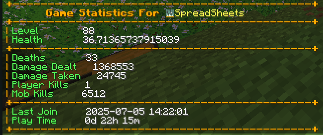

# 🎮 Player Statistics Minecraft Plugin

Player Statistics is a Minecraft server plugin that tracks and manages player statistics, providing useful commands and features for both players and server administrators.

---

## ✨ Features

- 💾 Integrates with MySQL for persistent data storage
- ⚡ Provides commands to view and sync player stats
- 📊 Tracks player statistics automatically
- 🔧 Easy to configure and extend

---

## 📷 Screenshots 



---

## 🚀 Getting Started

### 1. Installation

1. Download the latest compiled `.jar` file from the [Releases](https://github.com/SpreadSheets600/Minecraft-Statistics/releases) section.
2. Place the `.jar` file into your server's `plugins` directory.
3. Restart your Minecraft server.

### 2. Configuration

1. After the first run, a `config.yml` file will be generated in the plugin's folder.
2. Open `config.yml` and update the MySQL database settings and other options as needed:

    ```yaml
    mysql:
      host: localhost
      port: 3306
      database: minecraft
      username: root
      password: yourpassword
    ```

3. Save the file and restart the server to apply changes.

---

## 🕹️ Commands

| Command         | Description                        | Permission                  |
|-----------------|------------------------------------|-----------------------------|
| `/stats`        | View your statistics               | `playerstatistics.stats`    |
| `/syncplayers`  | Sync all player data with database | `playerstatistics.sync`     |
| `/debugger`     | Debug plugin operations (admin)    | `playerstatistics.debug`    |

---

## 🛠️ Building from Source

> **Note:** Most users do not need to build from source. Download the pre-built `.jar` from the releases if you just want to use the plugin.

1. Make sure you have [Java 17+](https://adoptopenjdk.net/) and [Maven](https://maven.apache.org/) installed.
2. Clone this repository:

    ```sh
    git clone https://github.com/yourusername/PlayerStatistics.git
    cd PlayerStatistics
    ```

3. Build the plugin:

    ```sh
    mvn clean compile
    mvn clean package
    ```

4. The compiled `.jar` will be in the `target/` directory.

---

## 🤝 Contributing

Contributions are welcome! To contribute:

1. Fork this repository and create your feature branch (`git checkout -b feature/AmazingFeature`)
2. Commit your changes (`git commit -m 'Add some AmazingFeature'`)
3. Push to the branch (`git push origin feature/AmazingFeature`)
4. Open a Pull Request

Please follow the existing code style and include clear commit messages.

---

## 💬 Support

For issues or feature requests, please open an issue on GitHub.
